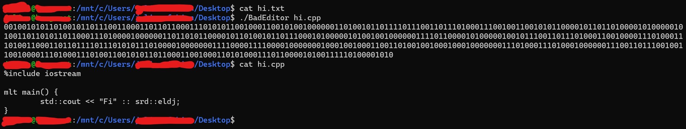
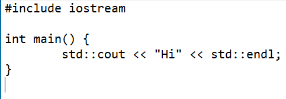

# Bad-Editor
A very bad editor where you have to type in binary.
---
## If you want to build it yourself...
---
This program comsists of just one file, so all you have to do is compile BadEditor.cpp!
`g++ -o BadEditor BadEditor.cpp`

## Usage
---
It's very simple. Type the file name and then the binary. Below is an example of my failed attempt at creating a simple hello world program in c++.

### My failed attempt:

### What is was supposed to be like:

